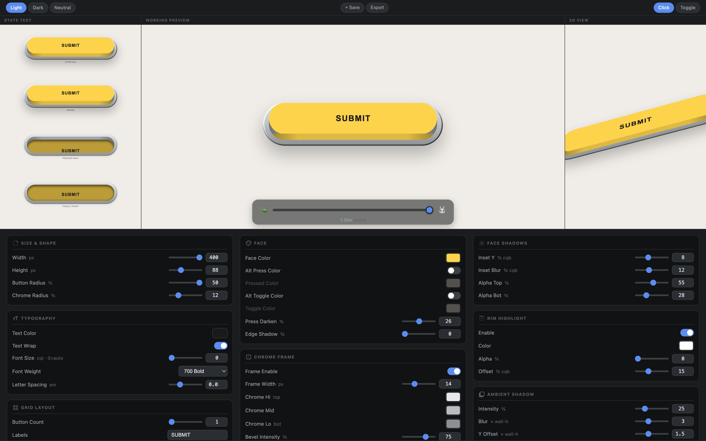

# Clicky Button Generator

Design tactile, skeuomorphic **"clicky" buttons** in the browser — tune every detail with live sliders, watch them press and toggle in 2D and 3D, then export drop-in HTML + CSS. No build step, no framework, no JavaScript required in the buttons themselves: the press/hover/toggle motion is pure CSS.

**▶ [Open the generator](https://lampagj.github.io/clicky-button/)**



---

## Generate a button in 30 seconds

1. **[Open the generator](https://lampagj.github.io/clicky-button/)** (or run it locally — see [below](#run-it-locally)).
2. **Tweak.** Every control updates the preview instantly. The big preview shows the working buttons; the top strip shows each state frozen side-by-side (resting · hover · pressed · toggled); the right panel shows a 3D view.
3. **Pick a mode** — *Click* (springs back) or *Toggle* (stays down) — with the toggle top-right of the preview.
4. **Check it on your background** — flip the preview between *Light / Dark / Neutral*.
5. **Export.** Hit **Export** to download a `.zip` with a standalone `.html` + `.css` (plus an optional `.enhancer.js` progressive-enhancement script — never required, since press/toggle motion is pure CSS) you can drop straight into a page. Hit **+ Save** to keep the current style in the in-app style picker so you can compare variants.

The exported CSS is self-contained — the only requirement (`container-type: size` on the button cell, which makes the sizing responsive) is already baked in.

---

## What you can modify

Controls are grouped into cards. Everything is live and reversible (there's a **Reset to defaults**).

| Card | Controls |
|---|---|
| **Size & Shape** | Width, Height, Button corner radius, Chrome (housing) corner radius |
| **Typography** | Text color, text wrap, font size, font weight, letter spacing |
| **Grid Layout** | Button count, labels, flex direction, wrap, gap, justify, align |
| **Face** | Face color, alternate Pressed color, alternate Toggle color, press-darken amount, face edge shadow |
| **Chrome Frame** | Frame on/off, frame width, three-stop chrome gradient (Hi / Mid / Lo), bevel intensity & width |
| **Depth** | Press depth (how far the key travels), wall band height (the visible side of the key) |
| **Button Wall** | The *moving side of the keycap*: color (defaults to face color) + its own alpha, edge-darken, and gradient-spread |
| **Button Cavity** | The *static housing slot* revealed on press: color (defaults to chrome) + its own alpha, edge-darken, and gradient-spread |
| **Face Shadows** | Inset shadow Y offset & blur, top/bottom inset alpha (the recessed-when-pressed look) |
| **Rim Highlight** | On/off, highlight color, alpha (the lit top edge) |
| **Ambient Shadow** | Drop-shadow intensity, blur, Y offset, and how much it shrinks while pressed |
| **Timing & Easing** | Release & press durations, easing preset or custom cubic-bézier, overshoot, toggle-rest feel |
| **Animation Timing** | Per-property delays for the shadow and color transitions |
| **Hover, Focus & Border** | Hover lift, focus style/color/size, border width/color/style |

### The two walls

This generator models a real keycap as two independently-styled surfaces, which is what gives it depth:

- **Button wall** — the side of the key itself. It moves *with* the key when pressed and defaults to the face color.
- **Button cavity** — the fixed slot inside the housing, revealed *above* the key as it descends. Defaults to the chrome color.

Each has its own color toggle, alpha, edge-darken, and gradient-spread, so you can make the key read as anything from a soft rubber dome to a hard plastic chiclet in a metal frame.

---

## Use the output

### Option A — drop-in HTML + CSS (no dependencies)

Unzip the **Export** download and reference the CSS (the optional `.enhancer.js` file adds a full symmetric press bounce — see the commented-out `<script>` tag in the exported HTML; never required, since press/toggle motion is already pure CSS):

```html
<link rel="stylesheet" href="my-button.css">
<!-- ...the .html file shows the exact markup; copy the .btn-grid block -->
```

### Option B — generate at runtime with the ES module

`lib/clicky-button.js` is a dependency-free ES module that produces the same CSS and HTML programmatically:

```js
import { buildClickyCss, buildClickyHtml } from './lib/clicky-button.js';

// Inject scoped CSS once...
const style = document.createElement('style');
style.textContent = buildClickyCss({ faceColor: '#c8c0b4', mode: 'click' }, { scope: ':root' });
document.head.appendChild(style);

// ...and stamp out markup.
document.querySelector('#play').outerHTML = buildClickyHtml({ label: 'PLAY' });
```

Public API: `buildClickyCss(config?, opts?)`, `buildClickyHtml({ label, tag, attrs, config? })`, `buildClickyGroupHtml(config?, opts?)` (a shared housing across multiple `.btn-cell` children — required, not `buildClickyHtml`, whenever `housingLayout` is `'segmented'`), `buildClickyVars(config?)` (the raw CSS custom-property map), and `defaultClickyConfig` (every option with its default). Full config reference: the `@typedef {object} ClickyConfig` block at the top of [`lib/clicky-button.js`](lib/clicky-button.js) — the live, authoritative contract (the earlier design spec is archived at [`claudedocs/past/clicky-button-importable-module-spec.md`](claudedocs/past/clicky-button-importable-module-spec.md)).

### Use as a package

*(Future — once published. Currently `"private": true` in `package.json`; see [Project layout](#project-layout) to use the module directly from a clone instead.)*

```bash
npm install clicky-button
```

```js
// Generate CSS + HTML programmatically
import { buildClickyCss, buildClickyHtml, buildClickyGroupHtml, buildClickyVars, defaultClickyConfig } from 'clicky-button';

const css = buildClickyCss({ faceColor: '#c8c0b4', mode: 'click' }, { scope: ':root' });
const html = buildClickyHtml({ label: 'PLAY' });

// Optional progressive-enhancement script (adds a full symmetric press bounce;
// never required — press/toggle motion is already pure CSS)
import { enhanceClickyButtons } from 'clicky-button/enhancer';
enhanceClickyButtons(document.querySelector('.btn-grid'));
```

**CSS-var theming contract:** `buildClickyCss` emits a scoped block of `--clicky-*` custom properties (scope selector via `opts.scope`, default `:root`) that `buildClickyHtml`/`buildClickyGroupHtml`'s markup reads at render time — regenerate the CSS block (not the HTML) to retheme already-rendered buttons, or scope multiple configs side-by-side by giving each its own `opts.scope` selector instead of `:root`.

---

## Run it locally

It's a static site, but it loads its library as an ES module, so it needs to be served over HTTP (not opened as a `file://`):

```bash
git clone https://github.com/LampaGJ/clicky-button.git
cd clicky-button
python3 -m http.server 8000      # or: npx serve
# open http://localhost:8000
```

---

## Project layout

| File | Purpose |
|---|---|
| `index.html` | The generator UI (control panel + previews) |
| `app.js` | Wires the controls to state, live preview, save/export |
| `styles.css` | Styling for the generator app itself |
| `lib/clicky-button.js` | The importable, dependency-free button engine |
| `gallery.html` | Standalone QA/showcase page: a 24-tile variation matrix generated live from `lib/clicky-button.js` |
| `claudedocs/` | Config spec & design notes |
